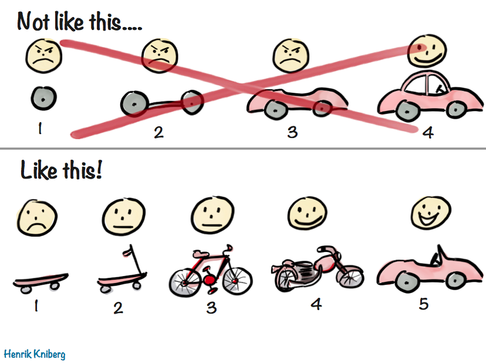

# Inspiring Images

Let's build MVPs like this together!

# Inspiring Quotes

> The best time to plant a tree was 20 years ago. The second best time is now.
>
> \- Chinese Proverb

**My take:** Get started, prepare, plan, and think as soon as possible. Sure it would've been better sooner but right now is as good a time as you'll get.

> Never attribute to malice that which is adequately explained by stupidity.
>
> \- Hanlon's razor

**My take:** More often than not, negative situations are the result of lack of thought or miscommunication rather than an effort to be cruel.

> You must be the change you wish to see in the world.
>
> \- Mahatma Gandhi (attributed)

**My take:** No one is coming to save you or do it for you. If you want to see something different, you need to take ownership of making it happen. The more modern version is "put up or shut up 😂"

> All problems in computer science can be solved by another level of indirection, except for the problem of too many layers of indirection.
>
> \- [Matt Rickard] ([blog post](https://blog.matt-rickard.com/p/stop-overengineering) on the many)_

**My take:** Overengineering is an incredibly common pitfall for all developers and especially experienced developers. It's difficult to address and nail down and this blog post is a collection of useful analysis on it.

I believe one should reread [99 Bottles of OOP](https://sandimetz.com/99bottles) after every milestone (new job, promotion, etc.). I wish I had had the opportunity to read this when I first started writing software (it didn't exist yet) and am grateful I opened my mind and read it years into my career. I cannot recommend any other book more highly if you want to write the best most maintainable, flexible, and reliable software you can.
